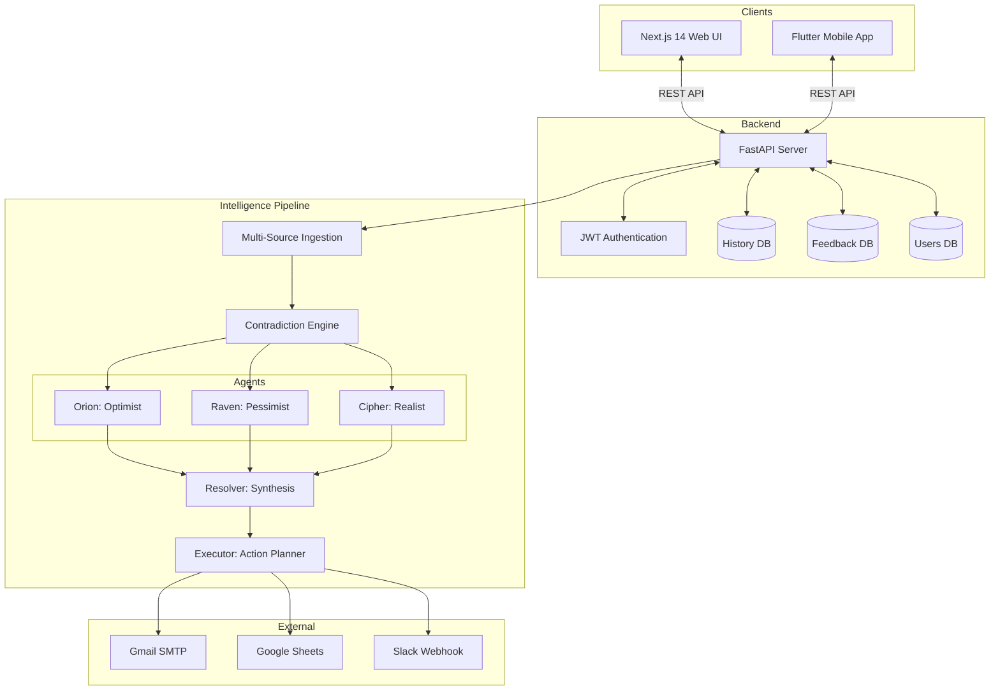

# InsightFlow — Autonomous Content-to-Action Intelligence

> **Hackathon Challenge 1** — Autonomous Content-to-Action Agent
> Developed in **Antigravity AI IDE** · Runtime: **Google ADK + Gemini 2.0 Flash**
> **Web** (Next.js 14) · **Mobile** (Flutter) · **Backend** (FastAPI)

InsightFlow ingests unstructured multi-source intelligence, runs a 5-agent parallel debate to detect contradictions and resolve uncertainty, then produces a constraint-validated 5-step action chain that triggers real-world integrations automatically.

---

## System Architecture



---

## LLM Call Priority (per request)

1. **OpenRouter** (free tier) — `meta-llama/llama-3.1-8b-instruct:free` (and fallbacks)
2. **Google ADK** — if `google-adk` package is installed
3. **Direct Gemini** — `gemini-1.5-flash` → `gemini-2.0-flash-lite` → `gemini-2.0-flash`

---

## Agent System

| Agent | Role | Behavior |
|-------|------|----------|
| **Orion** | Optimist | Finds hidden opportunities, first-mover advantages, upside |
| **Raven** | Pessimist | Identifies worst-case risks, cascading failure points |
| **Cipher** | Realist | Probability-weighted assessment with confidence intervals |
| **Resolver** | Synthesis | Evidence-weighted reconciliation of all 3 agent outputs |
| **Executor** | Action Planner | 5-step causal chain with constraint validation per step |

**Agent Learning Loop:**
- Users rate analyses 1–5 (emoji feedback widget on web and mobile)
- Last 15 ratings per domain stored in `feedback.json`
- Negative feedback → agents instructed to "cite sources, name specific entities"
- Positive feedback → agents told to "maintain this reasoning style"
- Learning context injected into every Gemini prompt for that domain

---

## Tech Stack

| Layer | Technology |
|-------|-----------|
| **Web Frontend** | Next.js 14, TypeScript, Tailwind CSS, App Router |
| **Mobile App** | Flutter 3.x, Dart |
| **Backend API** | FastAPI, Python 3.10+, uvicorn |
| **AI Runtime** | Google ADK, google-generativeai (Gemini 2.0 Flash) |
| **Authentication**| JWT (PyJWT), SHA-256 + salt password hashing |
| **Storage** | JSON flat files (`users.json`, `history.json`, `feedback.json`) |
| **Integrations** | Gmail SMTP, Google Sheets API, Slack Webhook |

---

## Feature Parity: Web vs Mobile

| Feature | Web (Next.js) | Mobile (Flutter) |
|---------|--------------|-----------------|
| Login / Register | ✅ | ✅ |
| Domain select + seed presets | ✅ | ✅ |
| Ingestion (Text / URL / CSV / Feed) | ✅ | ✅ |
| Ingestion (PDF Upload) | ✅ | ❌ |
| 5-agent debate visualization | ✅ | ✅ |
| Action chain & constraints display| ✅ | ✅ |
| What-if counterfactual analysis | ✅ | ✅ |
| Feedback widget (Learning loop) | ✅ | ✅ |
| Analysis history (List, Detail, Delete) | ✅ | ✅ |
| Baseline comparison | ✅ | ✅ (Dialog) |
| Live execution logs | ✅ | ✅ (Polling) |
| Admin Dashboard (User & Run mgmt)| ✅ | ❌ (Web Only)|
| Trace Viewer (`antigravity_trace.json`) | ✅ | ❌ (Web Only)|

---

## Complete API Reference

### Auth
| Method | Endpoint | Auth | Description |
|--------|----------|------|-------------|
| POST | `/auth/register` | — | `{name, email, password}` |
| POST | `/auth/login` | — | `{email, password}` |
| GET | `/auth/me` | JWT | Get current user info |
| PUT | `/auth/me` | JWT | Update user profile |

### Intelligence Pipeline
| Method | Endpoint | Auth | Description |
|--------|----------|------|-------------|
| POST | `/ingest` | — | Multipart form (text, url, csv, file, domain) |
| POST | `/analyze` | — | `{domain, constraints}` → Runs 5-agent debate |
| POST | `/execute` | — | `{domain, chain}` → Simulates action chain |
| POST | `/what-if` | — | `{modifications}` → Counterfactual re-run |
| GET | `/state` | — | Pipeline state snapshot |
| GET | `/logs` | — | Execution logs |
| GET | `/baseline-comparison`| — | Agentic vs Heuristic metrics |

### History & Feedback
| Method | Endpoint | Auth | Description |
|--------|----------|------|-------------|
| POST | `/history` | JWT | Save analysis |
| GET | `/history` | JWT | List user history |
| GET | `/history/{id}` | JWT | Get history detail |
| DELETE| `/history/{id}` | JWT | Delete history entry |
| POST | `/feedback` | JWT | Submit user rating & comment |
| GET | `/feedback/stats` | JWT | Global domain feedback stats |
| GET | `/feedback/my` | JWT | Current user's feedback |

### Admin (requires `is_admin: true`)
| Method | Endpoint | Auth | Description |
|--------|----------|------|-------------|
| GET | `/admin/users` | Admin JWT| List all users |
| GET | `/admin/history` | Admin JWT| View all platform execution runs |
| GET | `/admin/feedback` | Admin JWT| View all platform feedback |
| GET | `/admin/dashboard-stats` | Admin JWT| KPI counts and metrics |
| POST | `/admin/toggle-role` | Admin JWT| Promote/Demote users |
| DELETE| `/admin/history/{id}` | Admin JWT| Purge run log |
| POST | `/admin/reset-feedback` | Admin JWT| Wipe feedback & reset agent learning |

---

## Quick Start

### 1. Backend

```bash
cd backend
pip install -r requirements.txt
```

Create `backend/.env`:
```env
GOOGLE_API_KEY=your_gemini_key
OPENROUTER_API_KEY=your_openrouter_key     # Optional
SMTP_USER=you@gmail.com                    # Optional
SMTP_PASS=xxxx xxxx xxxx xxxx              # Optional
NOTIFY_EMAIL=recipient@example.com         # Optional
GOOGLE_SHEET_ID=your_sheet_id              # Optional
SLACK_WEBHOOK_URL=https://hooks.slack.com/ # Optional
```

```bash
uvicorn main:app --reload --port 8000
```
*Note: Admin account `admin@nexus.ai` / `admin12345` is seeded on first boot.*

### 2. Web Frontend

```bash
cd frontend-next
npm install
```

Create `frontend-next/.env.local`:
```env
NEXT_PUBLIC_API_URL=http://localhost:8000
```

```bash
npm run dev
```

### 3. Mobile (Flutter)

```bash
cd nexus_mobile
flutter pub get
```

Update `nexus_mobile/lib/config.dart` to your backend URL (e.g., `http://10.0.2.2:8000` for Android emulator).

```bash
flutter run
```

---

## Trace Viewer & Antigravity IDE

InsightFlow was developed using the **Antigravity AI IDE**. The runtime application is fully standalone. 

You can load `antigravity_trace.json` into the web application's **Trace Viewer** (`/trace`) to inspect all 23 development events—phases, tool calls, decisions, and recovery events—which perfectly match the `PLAN.md` workplan.
